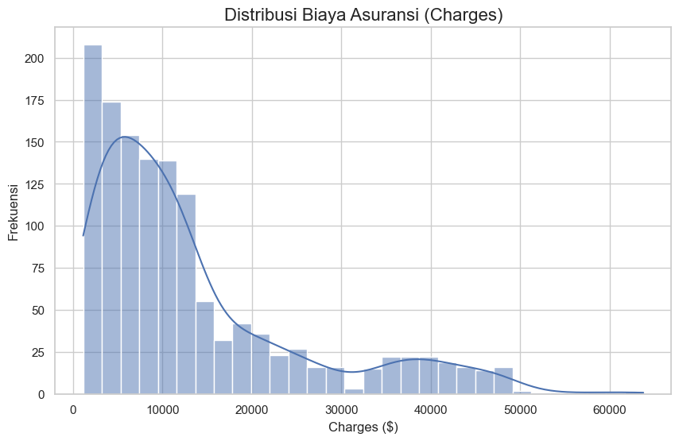
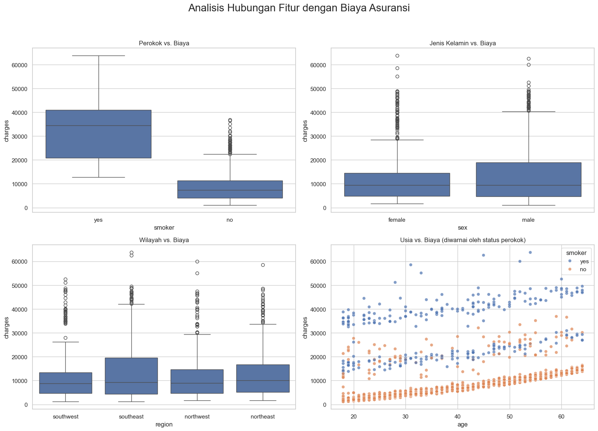
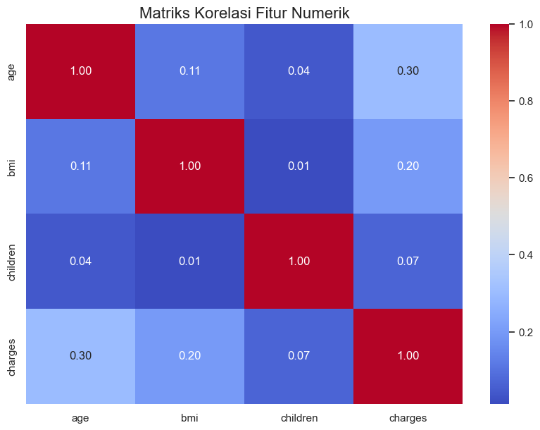
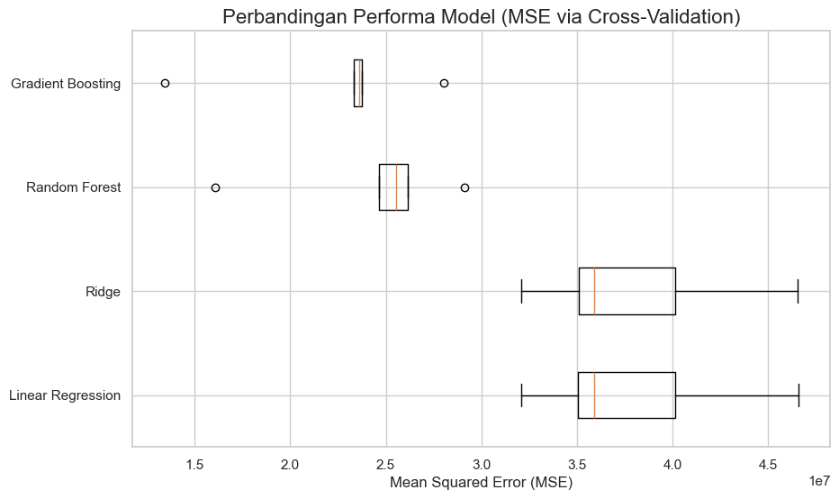
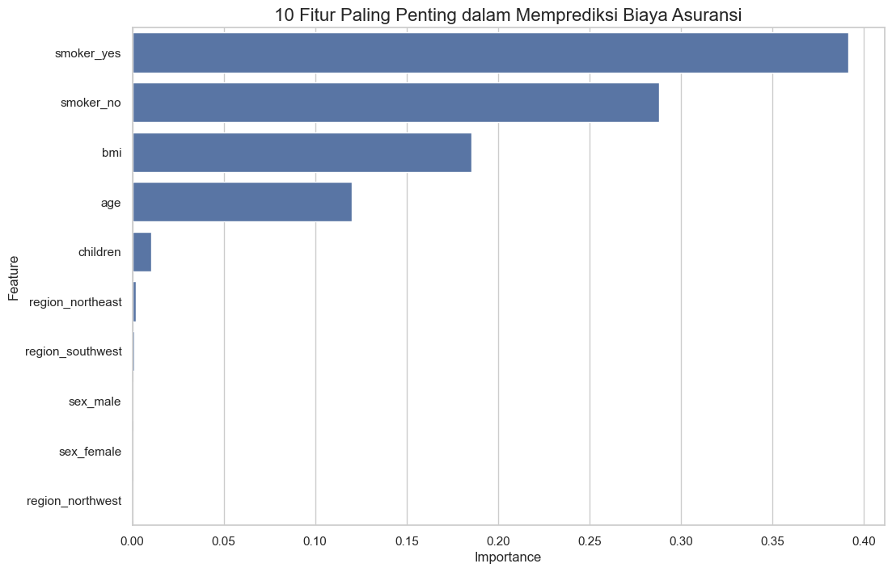

# Prediksi Biaya Asuransi Medis — Model regresi untuk mengestimasi biaya klaim asuransi kesehatan berdasarkan profil personal dan gaya hidup

## 🎯 Masalah
Perusahaan asuransi kesehatan perlu memperkirakan biaya klaim (`charges`) seorang tertanggung sebelum polis diterbitkan, agar premi bisa ditentukan secara adil dan akurat. Proyek ini menjawab pertanyaan: **faktor apa saja yang paling memengaruhi biaya asuransi medis seseorang, dan seberapa akurat biaya tersebut bisa diprediksi dari data demografi serta gaya hidup?**

## 📊 Dataset
- **Ukuran:** 1.338 baris, 7 kolom, tanpa missing value.
- **Kolom:**
  - `age` — usia tertanggung
  - `sex` — jenis kelamin (male/female)
  - `bmi` — Body Mass Index
  - `children` — jumlah anak/tanggungan dalam polis
  - `smoker` — status merokok (yes/no)
  - `region` — wilayah tempat tinggal (southwest, southeast, northwest, northeast)
  - `charges` — **variabel target**, biaya medis yang ditagihkan (USD)

## 🔧 Metode
1. **EDA** — analisis distribusi `charges`, hubungan tiap fitur terhadap biaya (boxplot untuk `smoker`, `sex`, `region`; scatterplot untuk `age`), dan matriks korelasi.
2. **Preprocessing** — train-test split (80/20), `StandardScaler` untuk fitur numerik dan `OneHotEncoder` untuk fitur kategorikal, digabung dalam satu `ColumnTransformer`.
3. **Model Comparison** — 5-fold cross-validation membandingkan `Linear Regression`, `Ridge`, `Random Forest`, dan `Gradient Boosting`.
4. **Hyperparameter Tuning** — `RandomizedSearchCV` (50 iterasi, 5-fold CV) pada `Gradient Boosting Regressor`.
5. **Evaluasi Akhir** — MAE, RMSE, R² pada data uji, dilanjutkan analisis feature importance dan plot actual vs prediction.

## 📈 Hasil
**Temuan utama dari EDA:**
- Distribusi `charges` sangat *right-skewed* — mayoritas biaya rendah, sebagian kecil sangat tinggi.
- `smoker` adalah pembeda biaya paling besar antara perokok dan non-perokok.
- `age` dan `bmi` berkorelasi positif dengan `charges`; `sex` dan `region` pengaruhnya kecil.

**Model juara:** `Gradient Boosting Regressor` (setelah tuning) mengungguli Linear Regression, Ridge, dan Random Forest pada cross-validation.

**Metrik akhir (data uji):**
- **R² = 0.878** (model menjelaskan 87,8% variasi biaya asuransi)
- **RMSE ≈ $4.293**







## 💡 Insight & Rekomendasi
1. **Status merokok adalah faktor #1** yang mendorong biaya asuransi jauh di atas faktor lain — program bantuan berhenti merokok berpotensi jadi cara paling efektif menurunkan biaya klaim.
2. **BMI dan usia** adalah faktor penting berikutnya — inisiatif wellness (menjaga berat badan ideal) bisa membantu menekan biaya jangka panjang.
3. **Jumlah anak** berkontribusi kecil terhadap biaya, sementara **wilayah dan jenis kelamin** pengaruhnya minim dan tidak signifikan secara mandiri.
4. Model ini dapat digunakan perusahaan asuransi sebagai alat bantu estimasi premi awal berdasarkan profil kesehatan dan gaya hidup calon tertanggung.

## 🚀 Cara Menjalankan
```bash
pip install -r requirements.txt
```
Lalu buka `notebooks/project_asuransi_medis.ipynb` dan jalankan seluruh sel secara berurutan.
